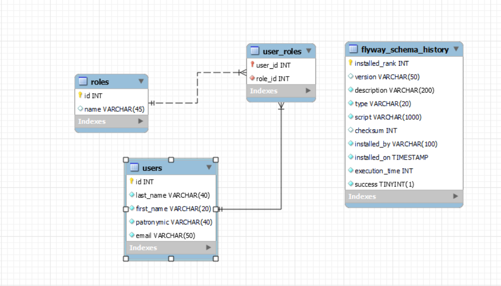
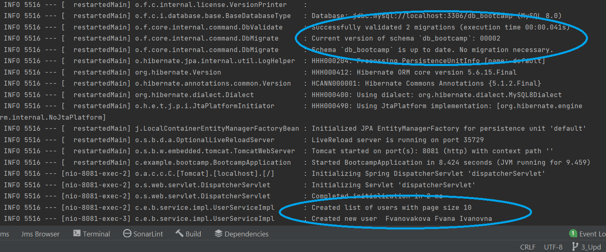
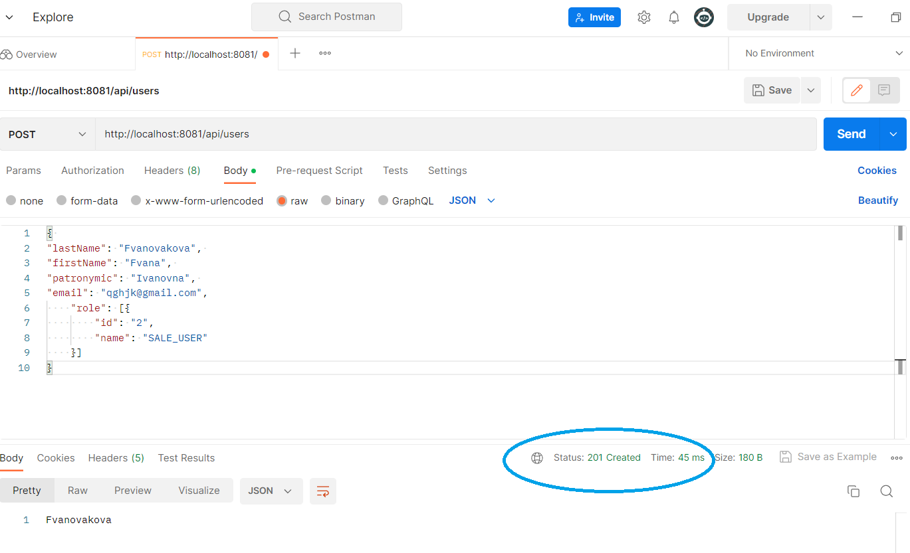
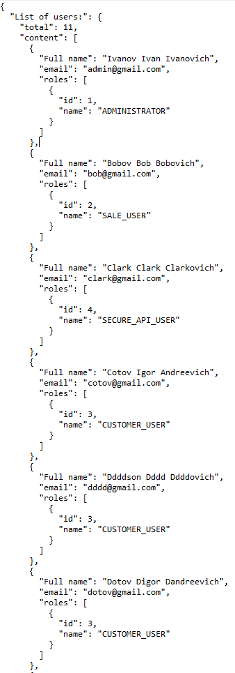
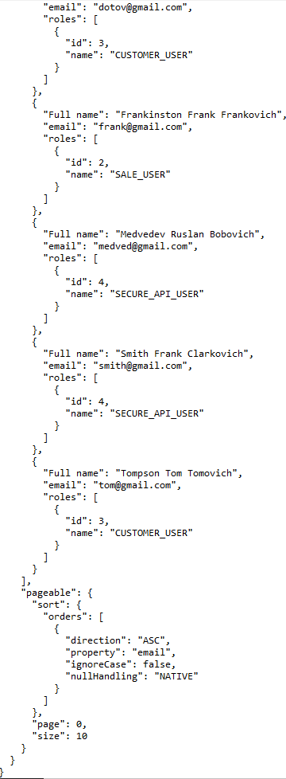

<h1>Backend Test task</h1>
<h2>Test task - IT</h2>

## List of used technologies
● Java 11 ● Spring Boot 2 ● Maven  ● MySQL 8 ● FlyWay
● Hibernate 5 ● Lombok ● Log4J ● jUnit 

## Getting Started

 Java version 11+ is required.

#### Clone the repository
  
>Intellij IDEA -> Git -> Clone -> Url -> https://github.com/kursonchik/ITAcademy

or

```console
git clone https://github.com/kursonchik/ITAcademy.git
```

### Create MySQL Database

Example:

```
create SCHEMA IF NOT EXISTS db_bootcamp;
use db_bootcamp;
    
```
DDL operations are stored in src/main/resources/db/migration;

database connection settings in application.properties

### Run BootcampApplication

### Run Postman

Example POST:
```
{ 
"lastName": "Fvanovakova", 
"firstName": "Fvana", 
"patronymic": "Ivanovna", 
"email": "qghjk@gmail.com",
    "role": [{
        "id": "2",
        "name": "SALE_USER"
    }]
}
    
```

---

## Demo
Request/Response example








