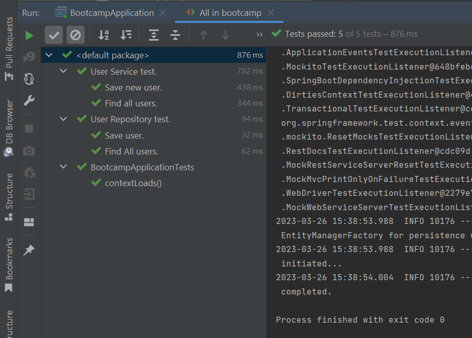
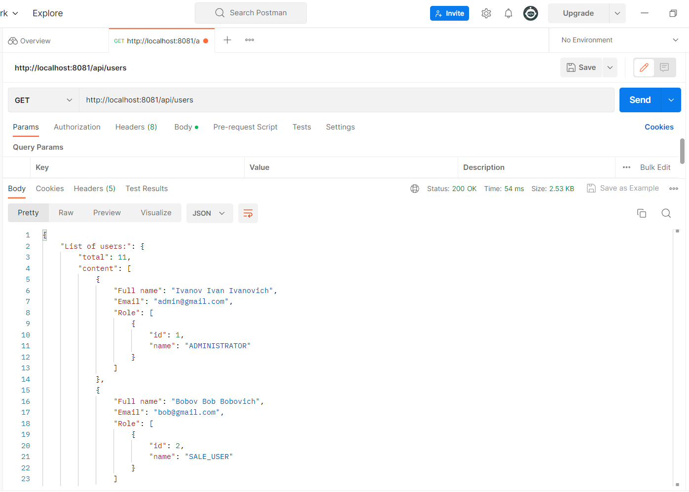
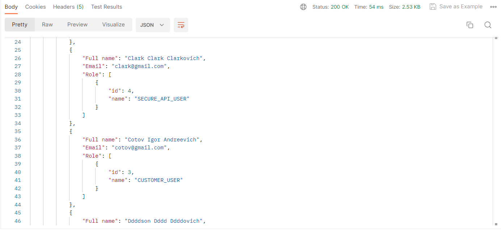
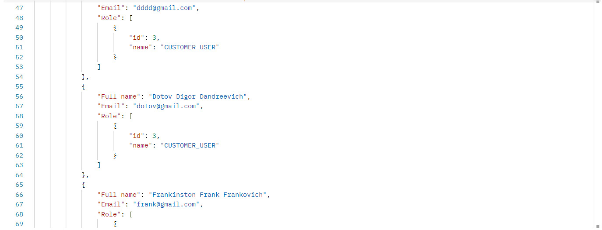
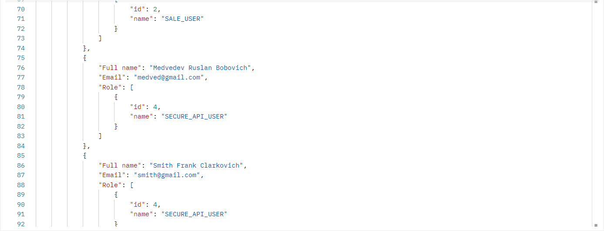
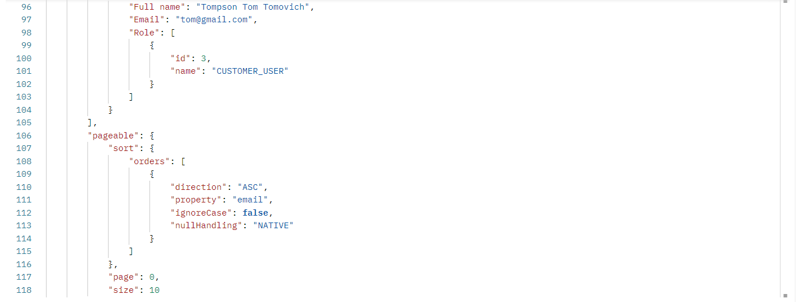

<h1>Test task - IT Практикум "Java developer"</h1>

## List of used technologies
● Spring Boot 2 ● Maven  ● MySQL 8 ● FlyWay
● Hibernate 5 ● Lombok ● Log4J ● jUnit 

## Getting Started

#### Clone the repository
  
>Intellij IDEA -> Git -> Clone -> Url -> https://github.com/kursonchik/ITAcademy

or

```console
git clone https://github.com/kursonchik/ITAcademy.git
```

### Create MySQL Database


DDL operations are stored in src/main/resources/db/migration;

database connection settings in application.properties

### 1) Run BootcampApplication
Run Spring Boot application with command: mvn spring-boot:run.
users table will be automatically generated in Database.

### 2) Run Postman
Now we can check operations with Postman.


---

## POST (Create some User)


## GET (Get all Users)




rows 93-95



